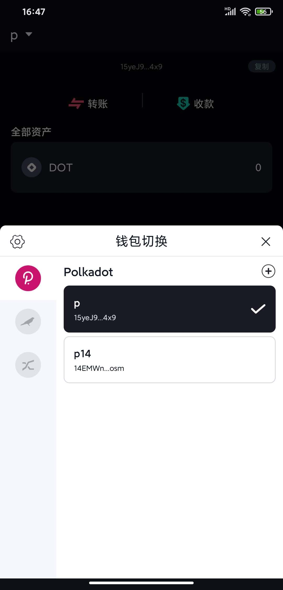
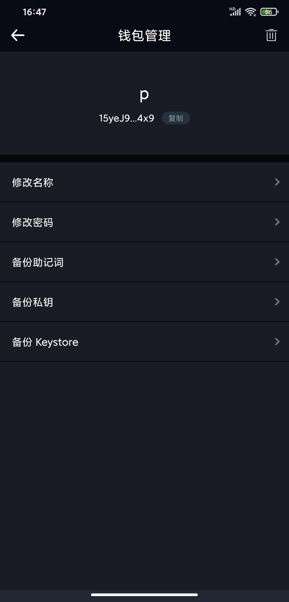

# aocoin-android

### Intro

澳波钱包开源版，实现波卡链钱包的创建、导入、转账等功能。

澳波开源钱包具有以下特点：

- 支持 polkadot、kusama、kulupu 互相切换
- 私钥本地存储
- 支持导入/创建多个钱包
- 支持钱包私钥/助记词/ keystone 备份
- 离线签名
- UI 友好，操作简单

添加钱包

资产显示

钱包切换

钱包备份

转账

### Features

- 钱包创建
- 钱包导入
  - 助记词导入
  - 私钥导入
  - keystone 导入
- 备份功能
  - 备份助记词
  - 备份私钥
  - 备份 keystone
- 钱包中的资产展示
- 钱包之间转账
- 多钱包之间的管理/切换

### Requirements

使用原生开发，需要安装对应原生开发环境

开发环境：Java、Android SDK

IDE：Android Stuido

Android 开发资料请移步：https://developer.android.google.cn/

### Todos

治理；

质押；

交易记录；

交易详情；

### Installation、Running

    git clone https://github.com/AoCoin-Lab/aocoin-android.git
    open project
    run project

### View more info of AoCoin

Website：https://aocoin.io/
github: https://github.com/AoCoin-Lab
